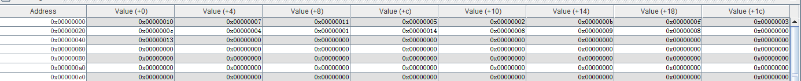
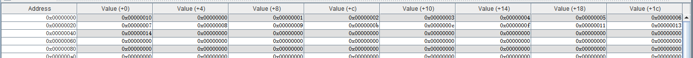
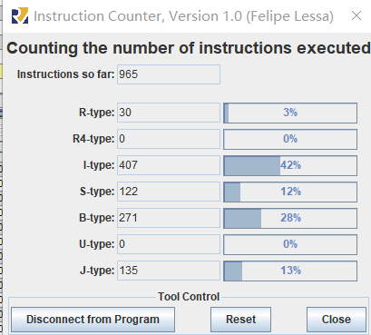

<!--
 * @Author: MomoTori
 * @Date: 2022-03-27 01:02:45
 * @LastEditors: MomoTori
 * @LastEditTime: 2022-04-08 18:18:13
 * @FilePath: \Ch2\report.md
 * @Description: 
 * Copyright (c) 2022 by MomoTori, All Rights Reserved. 
-->
# RISCV实现冒泡排序实验报告

## 目录

<!-- @import "[TOC]" {cmd="toc" depthFrom=1 depthTo=6 orderedList=false} -->

<!-- code_chunk_output -->

- [RISCV实现冒泡排序实验报告](#riscv实现冒泡排序实验报告)
  - [目录](#目录)
  - [源码](#源码)
  - [时间分析](#时间分析)

<!-- /code_chunk_output -->

## 源码

对于内存中已经存储好的数组，并且存有需要排序的数组数量，有如下的代码

```js
.data
number: .word 16
array: .word 7,17,5,2,11,15,3,12,4,1,20,6,9,8,0,19

.text
main:
    lw t0,0(zero)                   #.data从0x0000开始
    LOOP1:
        addi t0,t0,-1
        beqz t0,FIN
        addi t1,zero,4              # array address
        addi t2,t0,-1
        slli t2,t2,2                # t2=(t0-1)*4
        add t2,t2,t1                # t2 is the finish address
        LOOP2:
            blt t2,t1,LOOP2FIN
            lw t3,0(t1)
            lw t4,4(t1)
            blt t3,t4,SKIP
            sw t3,4(t1)
            sw t4,0(t1)
            SKIP:
            addi t1,t1,4
            j LOOP2
        LOOP2FIN:
        j LOOP1
    FIN:
    li a7, 10                       # Exit program
    ecall     
```

程序运行前.data段如下所示



程序运行后.data段如下所示，对照前面初始的array可知其排序成功



## 时间分析

对于数据量为n的array，其一共会完整经历n-1个Loop1和(n-1)(n-2)个Loop2，则总共的周期数为

而Loop1中除了Loop2的部分共有7条指令，而Loop2根据是否交换指令分别为8或6，则最坏情况下程序所用的总指令数为

$$f_{max}(n)=1+(n-1)\times 7+2+\frac{n(n-1)}{2}\times 8+1\times(n-1)=4n^2+4n-5$$

$$f_{min}(n)=1+(n-1)\times 7+2+\frac{n(n-1)}{2}\times 6+1=3n^2+5n-5$$

上面源码运行所用的指令如下图所示



而$f_{min}(16)=834<965<1083=f_{max}(16)$