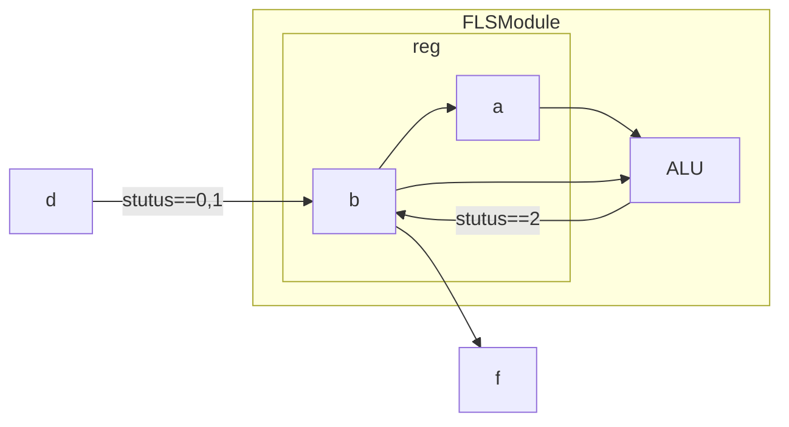
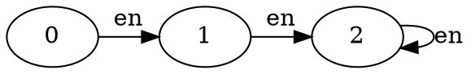
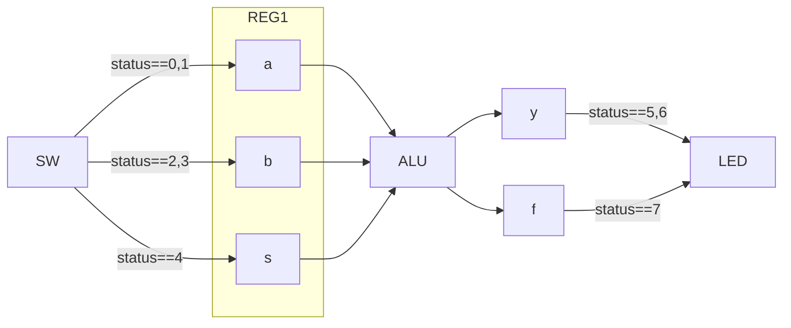
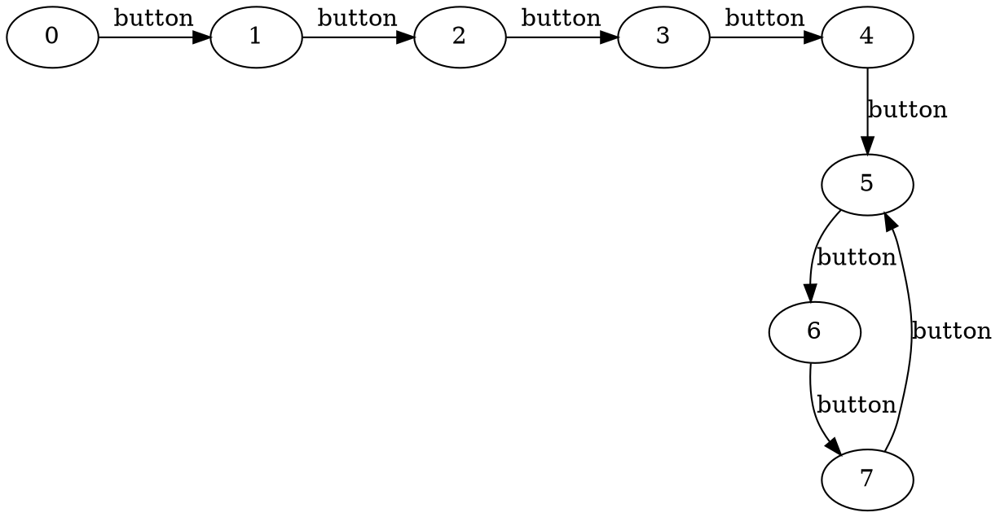
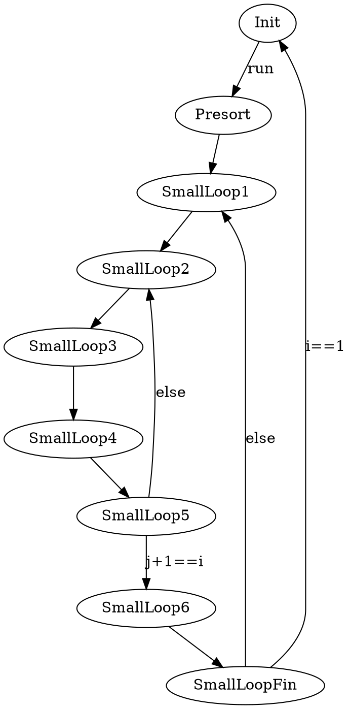

<!--
 * @Author: MomoTori
 * @Date: 2022-03-27 01:02:45
 * @LastEditors: MomoTori
 * @LastEditTime: 2022-03-29 21:07:01
 * @FilePath: \Lab2d:\Code Try\CODExperiment\report\Lab2\report.md
 * @Description: 
 * Copyright (c) 2022 by MomoTori, All Rights Reserved. 
-->
# 实验一  运算器及其应用

## 目录

<!-- @import "[TOC]" {cmd="toc" depthFrom=1 depthTo=6 orderedList=false} -->

<!-- code_chunk_output -->

- [实验一  运算器及其应用](#实验一-运算器及其应用)
  - [目录](#目录)
  - [附录文件一览](#附录文件一览)
  - [ALU模块](#alu模块)
    - [设计](#设计)
    - [仿真](#仿真)
    - [下载](#下载)
    - [RTL、资源、时间报告](#rtl-资源-时间报告)
      - [RTL电路图](#rtl电路图)
      - [电路资源报告](#电路资源报告)
      - [时间性能报告](#时间性能报告)
  - [FLS模块](#fls模块)
    - [设计](#设计-1)
    - [下载文件设计](#下载文件设计)
    - [仿真](#仿真-1)
    - [下载](#下载-1)
  - [32位ALU](#32位alu)
    - [设计](#设计-2)
    - [下载](#下载-2)
    - [RTL、资源、时间报告](#rtl-资源-时间报告-1)
      - [RTL电路图](#rtl电路图-1)
      - [电路资源报告](#电路资源报告-1)
      - [时间性能报告](#时间性能报告-1)
  - [问题解决](#问题解决)
    - [CPU_RESETN无需IP操作](#cpu_resetn无需ip操作)
    - [AN和SEG是低电平有效](#an和seg是低电平有效)
    - [AN的状态变化不能使用移位](#an的状态变化不能使用移位)
    - [模块寄存器特别是状态相关应初始化](#模块寄存器特别是状态相关应初始化)
    - [特别注意非阻塞赋值时的冲突问题](#特别注意非阻塞赋值时的冲突问题)
  - [实验总结](#实验总结)

<!-- /code_chunk_output -->

## 附录文件一览

.  
├── ALU.v //ALU设计文件  
├── ALU2.v //6位ALU实现文件  
├── ALU3_32bits.v //32位ALU实现文件  
├── FSL.v //FSL设计文件  
├── FSL2.v //FSL下载设计文件  
└── InputProcessing.v //输入处理模块设计文件

## ALU模块

### 设计

ALU核心模块代码如下：

该部分为运算结果输出，使用case进行输出。其中算数左移判断b的位数，若b超过数据宽度，则结果每一位均为a的符号位

```v
reg [WIDTH-1:0]rtemp;
assign y=rtemp;
always @(*) begin
    case(s) 
    3'b000:rtemp=a-b;
    3'b001:rtemp=a+b;
    3'b010:rtemp=a&b;
    3'b011:rtemp=a|b;
    3'b100:rtemp=a^b;
    3'b101:rtemp=a>>b;
    3'b110:rtemp=a<<b;
    3'b111:begin
        if(b<WIDTH)
            rtemp={{(WIDTH){a[WIDTH-1]}},a}>>b;
        else
            rtemp={(WIDTH){a[WIDTH-1]}};
    end
    default :rtemp<=0;
    endcase
end
```

该部分为标志位，其中符号小于$<_s$的实现使用溢出标志辅助判断

当a,b异号且a与a-b异号时，发生溢出。而溢出标志位和a-b的符号位异或得到符号小于$<_s$

```v
reg [2:0] rf;
assign f=rf;
wire OF;//判断是否溢出
assign OF=(a[WIDTH-1]^b[WIDTH-1])&(a[WIDTH-1]^rtemp[WIDTH-1]);
always @(*) begin
    if(s==0)
    begin
        if(rtemp==0)
            rf[0]=1;
        else 
            rf[0]=0;
        if(OF^rtemp[WIDTH-1])
            rf[1]=1;
        else 
            rf[1]=0;
        if(a<b)
            rf[2]=1;
        else 
            rf[2]=0;
    end
    else
        rf=0;
end
```

### 仿真

仿真值尽量挑选具有代表性的值，得到仿真图如下


### 下载

六位ALU的数据通路如下


实现代码如下

```v
module alu2(
input CLK100MHZ,
input [15:0] SW,
input CPU_RESETN,
input BTNC,
output [15:0]LED
);
reg [5:0]a=0;
reg [5:0]b=0;
reg [2:0]s=0;
reg [2:0]f=0;
reg [5:0]y=0;
wire [2:0]fo;
wire [5:0]yo;
assign LED[15:13]=f;
assign LED[5:0]=y;


always @(posedge CLK100MHZ or negedge CPU_RESETN) begin
    if(~CPU_RESETN)
        s<=0;
    else if(BTNC)
        s<=SW[15:13];
    else s<=s;
end

always @(posedge CLK100MHZ or negedge CPU_RESETN) begin
    if(~CPU_RESETN)
        a<=0;
    else if(BTNC)
        a<=SW[11:6];
    else a<=a;
end

always @(posedge CLK100MHZ or negedge CPU_RESETN) begin
    if(~CPU_RESETN)
        b<=0;
    else if(BTNC)
        b<=SW[5:0];
    else b<=b;
end

always @(posedge CLK100MHZ or negedge CPU_RESETN) begin
    if(~CPU_RESETN)
        f<=0;
    else 
        f<=fo;
end

always @(posedge CLK100MHZ or negedge CPU_RESETN) begin
    if(~CPU_RESETN)
        y<=0;
    else 
        y<=yo;
end

alu#(6) alu(a,b,s,yo,fo);

endmodule
```

下面是上板测试，其中输入为a=6'b100000,b=6'b000001,f=0

输出为y=6'b011111,f=3'b010


### RTL、资源、时间报告

#### RTL电路图


#### 电路资源报告


#### 时间性能报告


## FLS模块

### 设计

数据通路如下



FLS需要三个状态status设为0,1,2

1. 当FLS在状态0时，当clk上升沿en成立时，将b赋值为d
2. 当FLS在状态1时，当clk上升沿en成立时，将a赋值为b，将b赋值为d
3. 当FLS在状态2时，当clk上升沿en成立时，将a赋值为b，将b赋值为FLS的输出、

同时输出f始终为b的值，下面是FLS的状态图



则根据上面的设计得到fls设计文件如下

```v
module  fls (
    input  clk, 
    input  rstn, 
    input  en,
    input  [15:0]  d,
    output [15:0]  f
);
reg [15:0]a=0;
reg [15:0]b=0;
reg [1:0]status=0;
wire [15:0]out;

always @(posedge clk or negedge rstn) begin
    if(~rstn)
        a<=0;
    else if(en)
        a<=b;
    else a<=a;
end

always @(posedge clk or negedge rstn) begin
    if(~rstn)
        b<=0;
    else if(en)
        case(status)
        2'b00:b<=d;
        2'b01:b<=d;
        2'b10:b<=out;
        default:b<=b;
        endcase
    else b<=b;
end

always @(posedge clk or negedge rstn) begin
    if(~rstn)
        status<=0;
    else if(en)
        if(status==2'b10)
            status<=status;
        else
            status<=status+1;
    else status<=status;
end

assign f=b;

alu#(16) alu(.a(a),.b(b),.s(3'b001),.y(out));
endmodule
```

### 下载文件设计

首先需要对输入进行处理，处理文件如下所示

@import "InputProcessing.v"

则下载文件例化上面的处理单元和FLS模块即可，如下所示

@import "FSL2.v"


### 仿真

对FLS2仿真测试了(1,1)和(2,3)两个数据输入，以及resetn、button等功能测试


### 下载

前两张照片输入1,2，之后运行三次如图所示

.jpg)
.jpg)
.jpg)
.jpg)
.jpg)

## 32位ALU

### 设计

数据通路如下所示



a,b,y分别用两个状态进行输入输出

状态图如下所示，意义如下

0. 输入a的低十六位
0. 输入a的高十六位
0. 输入b的低十六位
0. 输入b的高十六位
0. 输入s
0. 输出y的低十六位
0. 输出y的高十六位
0. 输出f



根据如上设计，得到设计代码

@import "ALU3_32bits.v"

### 下载

输入按照顺序为0x0000,0x8000,0x0001,0x0000,0x0000

即a=0x80000000,b=0x00000001,s=0

输出如下图所示分别为0xFFFF,0x7FFF,0x0002

即y=0x7FFFFFFF,f=3'b010

.jpg)
.jpg)
.jpg)

### RTL、资源、时间报告

#### RTL电路图


#### 电路资源报告


#### 时间性能报告


## 问题解决

### CPU_RESETN无需IP操作

否则会一直置0

### AN和SEG是低电平有效

### AN的状态变化不能使用移位

AN<={AN,1}//错误

使用case循环与定义初始化较好

### 模块寄存器特别是状态相关应初始化

### 特别注意非阻塞赋值时的冲突问题

### 一定要按照格式

always @(posedge CLK100MHZ or negedge rstn) begin
    if(~rstn)

## 实验总结

通过本实验复习了verilog的写法，并能够设计ALU，使用ALU设计一些小应用

并且复习了端口的复用以及信号的处理


```verilog
//状态对应数据通路
always @(posedge CLK100MHZ or negedge rstn) begin
    if(~rstn)begin 
        cnt<=0;
        busy<=0;
    end
    else if(status!=Init)
    begin
    case (status)
        PreSort:begin
            busy<=0;
            cnt<=0;
            i<=256;
            j<=0;
            en<=0;
            Address<=0;
        end
        SmallLoop1:begin
            max<=spo;
            en<=0;
            cnt<=cnt+1;
        end
        SmallLoop2:begin
            en<=0;
            Address<=j+1;
            cnt<=cnt+1;
        end
        SmallLoop3:begin
            if(max<spo)begin
                max<=spo;
                temp<=max;
            end
            else temp<=spo;
            cnt<=cnt+1;
        end
        SmallLoop4:begin
            D<=temp;
            Address<=j;
            en<=1;
            cnt<=cnt+1;
        end
        SmallLoop5:begin
            j<=j+1;
            cnt<=cnt+1;
        end
        SmallLoop6:begin
            Address<=j;
            D<=max;
            cnt<=cnt+1;
        end
        SmallLoopFin:begin
            en<=0;
            Address<=0;
            j<=0;
            i<=i-1;
            cnt<=cnt+1;
            if(ifLoopFin) busy<=0;
        end
    endcase
    end
end
```

