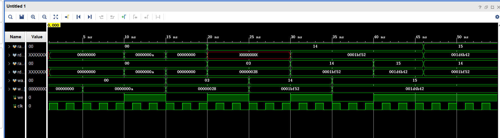
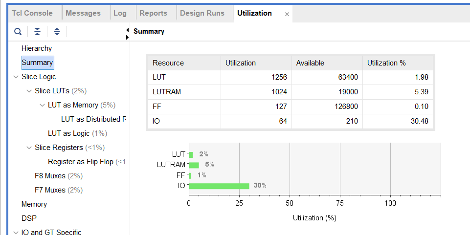

<!--
 * @Author: MomoTori
 * @Date: 2022-03-27 01:02:45
 * @LastEditors: MomoTori
 * @LastEditTime: 2022-04-05 11:49:50
 * @FilePath: \CODExperiment\report\Lab2\report.md
 * @Description: 
 * Copyright (c) 2022 by MomoTori, All Rights Reserved. 
-->
# 实验一  运算器及其应用

## 目录

<!-- @import "[TOC]" {cmd="toc" depthFrom=1 depthTo=6 orderedList=false} -->

<!-- code_chunk_output -->

- [实验一  运算器及其应用](#实验一-运算器及其应用)
  - [目录](#目录)
  - [附录文件一览](#附录文件一览)
  - [寄存器堆](#寄存器堆)
    - [设计](#设计)
    - [仿真](#仿真)
  - [分布式和块式RAM对比](#分布式和块式ram对比)
    - [IP核仿真](#ip核仿真)
  - [排序电路](#排序电路)
    - [非排序部分](#非排序部分)
    - [排序部分v0](#排序部分v0)
    - [排序部分v1](#排序部分v1)
    - [下载](#下载)
  - [分布式与块式RAM比较](#分布式与块式ram比较)
    - [RTL、资源、时间报告](#rtl-资源-时间报告)
      - [电路资源报告](#电路资源报告)
      - [时间性能报告](#时间性能报告)
      - [分析](#分析)
  - [问题解决](#问题解决)
    - [CPU_RESETN无需整流操作](#cpu_resetn无需整流操作)
    - [AN和SEG是低电平有效](#an和seg是低电平有效)
    - [寄存器应初始化且应按照格式](#寄存器应初始化且应按照格式)
  - [实验总结](#实验总结)

<!-- /code_chunk_output -->

## 附录文件一览

.  
├── HexToSeg.v //由十六进制信号转变为共阳极八段管信号  
├── InputProcessing.v //输入处理  
├── Nexys4DDR.xdc //xdc文件  
├── encoder.v  
├── register_32_32.v //32x32寄存器  
├── sort.v //256位单端口DRAM排序  
├── sortDownload.v //256位单端口DRAM排序下载至板  
├── sortTwoPart.v //256位伪双端口DRAM排序  
├── sort_4096_16_BRAM.v //4096位单端口BRAM排序  
└── sort_4096_16_DRAM.v //4096位单端口DRAM排序  

## 寄存器堆

### 设计

寄存器堆核心模块代码如下：

其中使用阻塞赋值得到`rf[0]`始终为0，并使用三元运算符判断地址与写使能信号得到写操作优先于读操作的特性

```v
module  register_file  #(
    parameter AW = 5,		//地址宽度
    parameter DW = 32		//数据宽度
)(
    input  clk,			//时钟
    input [AW-1:0]  ra0, ra1,	//读地址
    output [DW-1:0]  rd0, rd1,	//读数据
    input [AW-1:0]  wa,		//写地址
    input [DW-1:0]  wd,		//写数据
    input we			//写使能
);
reg [DW-1:0]  rf [0: (1<<AW)-1]; 	//寄存器堆
assign rd0 =(we==1&&ra0==wa)?wd: rf[ra0], rd1 =(we==1&&ra1==wa)?wd: rf[ra1];	//读操作
always  @(posedge  clk)begin
    if (we)  rf[wa]  =  wd;		//写操作
    rf[0]=0;
end
endmodule
```


### 仿真



## 分布式和块式RAM对比

### IP核仿真

分别设置分布式RAM、块式写优先RAM和读优先RAM，模拟得到下面的波形图


如图，OutBlkWF是块式写优先RAM，OutBlkRF是块式读优先RAM，OutDis是分布式写优先RAM

分析波形图可以发现，分布式RAM的读是异步的，写是和时钟同步的；而块式的读和写都是同步的，但输出上分别有读优先（输出为上一周期RAM内的数据）和写优先（输出为上一周期写入的数据）的区别


## 排序电路

### 非排序部分

数据通路如下


由上图得到每个部分的代码如下

```v
//输入处理
wire ifInput;//SW是否有输入
wire [3:0] code;//编码
assign ifInput=|DPsw;//十六位取或，若为1则有输入
encoder_16bits encoder_16bits(DPsw,code);//编码
```
```v

//声明部分

reg [15:0] D;//暂时数据
reg [7:0] Address;//当前地址
reg s;//用于判断输出
wire [15:0] spo;
reg en;
dist_mem_256_16 dist_mem_256_16(Address,D,CLK100MHZ,en,spo);


//sort部分声明，报告后面会再复制一次
reg [3:0]status;
wire ifSmallLoopFin;
wire ifLoopFin;
reg [15:0]max;
reg [15:0]temp;
reg [15:0]i;//大循环
reg [15:0]j;//小循环
assign ifLoopFin=(i==1);
assign ifSmallLoopFin=(j+1==i);
```

```v
//核心代码
//en
always @(posedge CLK100MHZ or negedge rstn) begin
    if(~rstn) en<=0;
    else
    case (status)
        Init:begin
        if(data) en<=1;
        else en<=0;
        end
        PreSort:en<=0;//sort部分
        SmallLoop1:en<=0;
        SmallLoop2:en<=0;
        SmallLoop4:en<=1;
        SmallLoopFin:en<=0;
    endcase
end
```
```v
//D部分
always @(posedge CLK100MHZ or negedge rstn) begin
    if(~rstn) D<=0;
    else 
    case (status)
        Init:begin
        if(ifInput) D<={D[11:0],code};
        if(del) D<=D[15:4];
        if(en | addr) D<=0;
        end
        SmallLoop4:D<=temp;//sort部分
        SmallLoop6:D<=max;
    endcase
end
```
```v
//Address部分
always @(posedge CLK100MHZ or negedge rstn) begin
    if(~rstn) Address<=0;
    else
    case (status)
        Init:begin
        if(chk) Address<=Address+1;
        else if(en&&status==Init) Address<=Address+1;
        else if(addr) Address<=D[7:0];
        end
        PreSort:Address<=0;//sort部分
        SmallLoop2:Address<=j+1;
        SmallLoop4:Address<=j;
        SmallLoop6:Address<=j;
        SmallLoopFin:Address<=0;
    endcase
end
```
```v
//s部分
always @(posedge CLK100MHZ or negedge rstn) begin
    if(~rstn) s<=0;
    else if(status==Init)
        if(chk) s<=0;
        else if(ifInput) s<=1;
        else if(del) s<=1;
        else if(en) s<=0;
        else if(addr) s<=0;
end
```
```v
always @(*) begin
    {SegData[23:20],SegData[19:16]}=Address;
    if(s) {SegData[15:12],SegData[11:8],SegData[7:4],SegData[3:0]}=D;
    else {SegData[15:12],SegData[11:8],SegData[7:4],SegData[3:0]}=spo;
end
```

其中编码encoder部分代码如下，为一个常见的16bits优先编码

```v
module encoder_16bits(
    input[15:0] in,
    output reg [3:0] out
);
always @(*) begin
    casex(in)
    16'b1xxxxxxxxxxxxxxx:out=4'hF;
    16'b01xxxxxxxxxxxxxx:out=4'hE;
    16'b001xxxxxxxxxxxxx:out=4'hD;
    16'b0001xxxxxxxxxxxx:out=4'hC;
    16'b00001xxxxxxxxxxx:out=4'hB;
    16'b000001xxxxxxxxxx:out=4'hA;
    16'b0000001xxxxxxxxx:out=4'h9;
    16'b00000001xxxxxxxx:out=4'h8;
    16'b000000001xxxxxxx:out=4'h7;
    16'b0000000001xxxxxx:out=4'h6;
    16'b00000000001xxxxx:out=4'h5;
    16'b000000000001xxxx:out=4'h4;
    16'b0000000000001xxx:out=4'h3;
    16'b00000000000001xx:out=4'h2;
    16'b000000000000001x:out=4'h1;
    16'b0000000000000001:out=4'h0;
    default:out=4'bxxxx;
    endcase
end
endmodule
```

仿真图如下


### 排序部分v0

因为对分布式RAM赋值操作不熟悉以及使用单端口分布式RAM的原因，版本v0的排序使用多个状态，效率较低

首先是变量声明以及排序时的状态图

```v
wire ifSmallLoopFin;
wire ifLoopFin;
reg [15:0]max;
reg [15:0]temp;
reg [15:0]i;//大循环
reg [15:0]j;//小循环
assign ifLoopFin=(i==1);
assign ifSmallLoopFin=(j+1==i);
```


根据上面的状态图得到下面的状态变化

```v
always @(posedge CLK100MHZ or negedge rstn) begin
    if(~rstn) status<=Init;//初始态
    else case (status)
        Init:if(run) status<=PreSort;//处在初始态，run信号到来时开始排序
        else status<=status;
        PreSort:status<=SmallLoop1;
        SmallLoop1:status<=SmallLoop2;
        SmallLoop2:status<=SmallLoop3;
        SmallLoop3:status<=SmallLoop4;
        SmallLoop4:status<=SmallLoop5;
        SmallLoop5:if(ifSmallLoopFin)status<=SmallLoop6;else status<=SmallLoop2;
        SmallLoop6:status<=SmallLoopFin;
        SmallLoopFin:if(ifLoopFin)status<=Init;
        else status<=SmallLoop1;
        endcase
end
```

而每个周期对应的数据通路如下所示

```verilog


//状态对应数据通路
always @(posedge CLK100MHZ or negedge rstn) begin
    if(~rstn)begin 
        cnt<=0;
        busy<=0;
    end
    else if(status!=Init)
    begin
    case (status)
        PreSort:begin
            busy<=0;
            cnt<=0;
            i<=256;
            j<=0;
            en<=0;
            Address<=0;
        end
        SmallLoop1:begin
            max<=spo;
            en<=0;
            cnt<=cnt+1;
        end
        SmallLoop2:begin
            en<=0;
            Address<=j+1;
            cnt<=cnt+1;
        end
        SmallLoop3:begin
            if(max<spo)begin
                max<=spo;
                temp<=max;
            end
            else temp<=spo;
            cnt<=cnt+1;
        end
        SmallLoop4:begin
            D<=temp;
            Address<=j;
            en<=1;
            cnt<=cnt+1;
        end
        SmallLoop5:begin
            j<=j+1;
            cnt<=cnt+1;
        end
        SmallLoop6:begin
            Address<=j;
            D<=max;
            cnt<=cnt+1;
        end
        SmallLoopFin:begin
            en<=0;
            Address<=0;
            j<=0;
            i<=i-1;
            cnt<=cnt+1;
            if(ifLoopFin) busy<=0;
        end
    endcase
    end
end
```

### 排序部分v1

通过将RAM改为分布式RAM，并优化状态变化，得到下图所示状态图，其中最常见状态的小循环已经优化到一个状态的循环


由上面状态图不难得到下面的代码

```v
wire ifSmallLoopFin;
wire ifLoopFin;
assign ifLoopFin=(i==1);
assign ifSmallLoopFin=(j+1==i);
//状态部分
always @(posedge CLK100MHZ or negedge rstn) begin
    if(~rstn) status<=Init;//初始状态
    else case (status)
        Init:if(run) status<=PreSort;//处在初始态，run信号到来时开始排序
        else status<=status;
        PreSort:status<=SmallLoop1;
        SmallLoop1:status<=SmallLoop2;
        SmallLoop2:if(ifSmallLoopFin)status<=SmallLoop3;else status<=SmallLoop2;
        SmallLoop3:status<=SmallLoopFin;
        SmallLoopFin:if(ifLoopFin)status<=Init;
        else status<=SmallLoop1;
        endcase
end
```

下面是变量声明和数据通路

```verilog


reg [15:0]max;
reg [15:0]i;//大循环
reg [15:0]j;//小循环

//状态对应数据通路
always @(posedge CLK100MHZ or negedge rstn) begin
    if(~rstn)begin 
        cnt<=0;
        busy<=0;
    end
    else if(status!=Init)
    begin
    cnt<=cnt+1;
    case (status)
        PreSort:begin
            busy<=0;
            i<=256;
            j<=0;
            en<=0;
            Address<=0;
            DAdd<=0;
            max<=0;
        end
        SmallLoop1:begin
            max<=spo;
            en<=0;
            Address<=j+1;
        end
        SmallLoop2:begin
            if(max<spo)begin
                max<=spo;
                D<=max
            end
            else D<=spo;
            DAdd<=j;
            en<=1;
            Address<=j+2;
            j<=j+1;
        end
        SmallLoop3:begin
            DAdd<=j;
            D<=max;
        end
        SmallLoopFin:begin
            en<=0;
            Address<=0;
            D<=0;
            j<=0;
            i<=i-1;
            if(ifLoopFin) busy<=0;
        end
    endcase
    end
end
```

### 下载

下载并排序后如图所示，所用周期为0x8381个时钟


## 分布式与块式RAM比较

### RTL、资源、时间报告


#### 电路资源报告

相同内容的前后两图分别为分布式与块式


---



#### 时间性能报告


#### 分析

由上面的对比可知，分布式RAM使用了更多的电路资源包括LUT、一些寄存器以及Muxes，在一些LUT资源较为紧张的电路中DRAM可能并不是一个很好的选择，而应选择BRAM

而根据时间报告得知DRAM的时间表现更好

## 问题解决

这里记录了一些实验过程发生的问题以及解决方法

### CPU_RESETN无需整流操作

若IP操作则异步性遭到破坏，且根据整流的实现可能会发生一直置0的情况

### AN和SEG是低电平有效

做试验前应仔细阅读说明书

### 寄存器应初始化且应按照格式

根据对vivado的观察，其会讲如下格式的代码
```v
always @(posedge CLK100MHZ or negedge rstn) begin
    if(~rstn)
        fun1;
    else
        fun2;
```
解释为设备启动时便调用fun1部分进行初始化，之后按照上面的描述运作

但如果不按照这个格式，如下面的代码

```v
always @(posedge CLK100MHZ or negedge rstn) begin
    if(rstn)
        fun2;
```

vivado综合时可能因为找不到初始化的部分，导致最后下载到板子后出现奇怪的bug，且此bug在模拟部分是不会显现出来，必须烧进板子才能被发现，不仅隐蔽而且调试时间更长

## 实验总结

通过本实验学习了内存IP核的设置和使用以及能够自主设计简单的状态来进行简单的功能如排序，并通过许多未曾设想的bug增强了自己写verilog的能力，以及学会了如何写出健壮性更强的代码