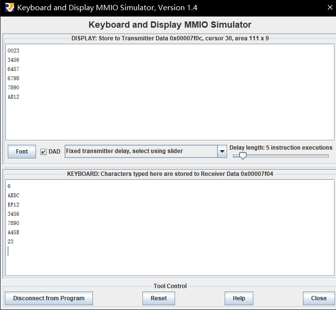

<!--
 * @Author: MomoTori
 * @Date: 2022-03-27 01:02:45
 * @LastEditors: MomoTori
 * @LastEditTime: 2022-04-10 10:50:05
 * @FilePath: \undefinedd:\CodeTry\CODExperiment\report\Lab3\report.md
 * @Description: 
 * Copyright (c) 2022 by MomoTori, All Rights Reserved. 
-->
# 实验三  汇编程序设计

## 目录

<!-- @import "[TOC]" {cmd="toc" depthFrom=1 depthTo=6 orderedList=false} -->

<!-- code_chunk_output -->

- [实验三  汇编程序设计](#实验三-汇编程序设计)
  - [目录](#目录)
  - [附录文件一览](#附录文件一览)
  - [简单测试指令](#简单测试指令)
  - [汇编数组排序](#汇编数组排序)
  - [实验总结](#实验总结)

<!-- /code_chunk_output -->

## 附录文件一览

.  
├── sort.asm/ 排序汇编代码  
└── test.asm/ 测试指令代码  

## 简单测试指令

通过LED的亮与暗来测试每个指令是否正常运行，具体内容在下面汇编代码注释

```js
.data				#假定起始地址为0
led_data:  .word  0xffff	#led指示灯状态，初始全亮
swt_data: .word  0xaa55 	#开关(switch)状态

.text
main:
	#test sw: led全灭
	sw 	zero, 0 (zero)
	
	#test addi: led全亮
	addi 	t0, zero, -1#t0=0xFFFFFFFF
	sw 	t0, 0 (zero)
	
	#test lw: 由switch设置led
	lw 	t0, 4 (zero)
	sw 	t0, 0 (zero)
	
	#test add：led全灭，之后显示0x0001
	addi 	t0, zero, -1#t0=0xFFFFFFFF
	addi	t1, zero,1#t1=1
	add	t0, t0, t1#t0=t0+t1=0
	sw	t0, 0 ( zero )
	sw 	t1, 0 (zero)#led显示0x0001
	
	#test sub：led全亮，之后显示0x0002
	sub	t0,t0,t1#t0=t0-t1=0xFFFFFFFF
	sw	t0, 0 ( zero )
	addi	t1,t1,1
	sw 	t1, 0 (zero)#led显示0x0002
	
	#test beq：过程中led全灭，直到led显示0x0003
	beq	t0,t1,skip1     #beq条件不成立
	sw 	zero, 0 (zero)
	skip1:
	add	t2, zero, t1    #t2=t1=1
	beq	t2,t1,skip2     #beq条件成立
	sw 	t0, 0 (zero)
	skip2:
	addi	t1,t1,1
	sw 	t1, 0 (zero)    #led显示0x0003
	
	#test blt：过程中led全亮，直到led显示0x0004
	blt	t1,t0,skip3     #blt条件不成立
	sw 	t0, 0 (zero)
	skip3:
	add	t2, zero, t1    #t2=t1=1
	blt	t0,t1,skip4     #blt条件成立
	sw 	zero, 0 (zero)
	skip4:
	addi	t1,t1,1
	sw 	t1, 0 (zero)    #led显示0x0004
	
	#test jal&jalr:分别先全亮、全暗之后全亮最后显示0x0005
	jal ra,Test         #测试jal的pc += sext(offset) 
	sw 	zero, 0 (zero)
	jalr zero,0(ra)     #测试jalr的x[rd] = pc+4
Test:
	sw 	t0, 0 (zero)
	jalr	ra,0(ra)      #测试jal的x[rd] = pc+4以及jalr的pc=(x[rs1]+sext(offset))~(-1)
	sw 	t0, 0 (zero)
	addi	t1,t1,1
	sw 	t1, 0 (zero)    #led显示0x0005
	
	#test auipc:led先全亮后显示0x0006
	auipc t2,1            #t2=pc0+1<<12=pc0+0x1000
	jal ra,Test2          #ra=pc0+4
Test2:
	addi t3,zero,0x700#t3=0x700
	add t3,t3,t3          #t3=0x800
	add t3,t3,t3          #t3=0x1000
	add t3,t3,ra          #t3=pc0+4+0x1000
	addi t3,t3,-4         #t3=pc0+0x1000==t2
	beq t3,t2,skip5
	sw 	t0, 0 (zero)
	skip5:
	addi	t1,t1,1
	sw 	t1, 0 (zero)    #led显示0x0006
```

## 汇编数组排序

实现简单的冒泡排序，并使用MMIO进行输入输出

```js
.data
buffer: .word 0,0,0,0,0,0,0,0,0,0,0,0,0,0,0,0,0,0,0,0,0,0,0,0,0,0,0,0,0,0,0,0,0,0,0,0,0,0,0,0,0,0,0,0,0,0,0,0,0,0,0,0,0,0,0,0,0,0,0,0,0,0,0,0,0,0,0,0,0,0,0,0,0,0,0,0,0,0,0,0
HexToASCII:.word '0','1','2','3','4','5','6','7','8','9','A','B','C','D','E','F'


.text
main:
  auipc t6,4
  addi t6,t6,0x780
  addi t6,t6,0x780#t6=7f00，为MMIO的地址
  addi t4,zero,1
  sw t4,8(t6)#初始化输出

#input
  la t5,buffer
  addi t5,zero,0#输入放置内存
  jal ra,inputNum
  addi t1,a0,0#t1为输入数量
  sw t1,0(t5)
  addi t5,t5,4
a:
  jal ra,inputNum
  sw a0,0(t5)
  addi t5,t5,4
  addi t1,t1,-1
  bne zero,t1,a

#sort
  addi t1,zero,0#buffer 位置
  lw t0,0(t1)
LOOP1:
  addi t0,t0,-1
  beqz t0,FIN
  addi t1,zero,4#buffer数组第一个数据
  addi t2,t0,-1
  slli t2,t2,2 #t2=(t0-1)*4
  add t2,t2,t1 #t2 is the finish address
  lw t3,0(t1)
LOOP2:
  blt t2,t1,LOOP2FIN
  lw t4,4(t1)
  bge t3,t4,skip
  mv t5,t3
  mv t3,t4
  mv t4,t5
skip:
  sw t4,0(t1)
  addi t1,t1,4
  j LOOP2
LOOP2FIN:
  sw t3,0(t1)
  j LOOP1
FIN:

#output
  addi t1,zero,0#buffer 位置
  lw t0,0(t1)
  addi t1,t1,4#buffer数组第一个数据
  addi t2,t0,0
  slli t2,t2,2 #t2=t0*4
  add t2,t2,t1 #t2 is the finish address
OutLoop:
  beq t2,t1,OutputFin
  lw t3,0(t1)
  srli t4,t3,12
  andi a0,t4,0xF
  jal ra,PutOut
  srli t4,t3,8
  andi a0,t4,0xF
  jal ra,PutOut
  srli t4,t3,4
  andi a0,t4,0xF
  jal ra,PutOut
  andi a0,t3,0xF
  jal ra,PutOut

LOOP3FIN:
  lw t4,8(t6)
  beq zero,t4,LOOP3FIN
  addi t4,zero,'\n'
  sw t4,12(t6)

  addi 	t1,t1,4
  j OutLoop

OutputFin:
  li a7, 10 # Exit program
  ecall

inputNum:
addi t3,zero,0#输入字符个数
Ag:lw t4,0(t6)
beq t4,zero,Ag
lw t4,4(t6)
addi t2,t4,-0x8#判断退格backspace
bne t2,zero,notBackspace
beq t3,zero,Ag
addi t3,t3,-1
addi sp,sp,4
j Ag
notBackspace:
addi t2,t4,-0xa#判断回车
beq t2,zero,process
addi t4,t4,-0x30#-'0'
addi t2,t4,-9#用于判断这个数是'0'-'9'还是'A'-'F'
bge zero,t2,notAF
addi t4,t4,-11#'0'-'A'
notAF:
sw t4,0(sp)
addi sp,sp,-4
addi t3,t3,1
j Ag
process:
slli t3,t3,2 #t3=4n
add t3,t3,sp#原sp位置
addi t0,t3,0#记录原sp
addi a0,zero,0
load:
beq t3,sp,loadfin
lw t2,0(t3)
slli a0,a0,4
add a0,a0,t2
addi t3,t3,-4
j load
loadfin:
addi sp,t0,0
jalr zero,0(ra)

PutOut:
la t5,HexToASCII
slli a0,a0,2 #*4
add a0,a0,t5
lw a0,0(a0)
Again:
lw t4,8(t6)
beq zero,t4,Again
sw a0,12(t6)
jalr zero,0(ra)
```

最终效果如图所示



## 实验总结

通过本实验学习了简单的RISC-V的汇编编写，并熟悉了MMIO的应用以及阻塞输入输出的原理