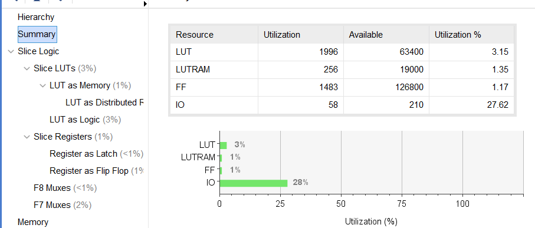

<!--
 * @Author: MomoTori
 * @Date: 2022-03-27 01:02:45
 * @LastEditors: MomoTori
 * @LastEditTime: 2022-04-18 11:16:05
 * @FilePath: \CODExperiment\report\Lab4\report.md
 * @Description: 
 * Copyright (c) 2022 by MomoTori, All Rights Reserved. 
-->
# 实验四  单周期CPU设计

## 目录

<!-- @import "[TOC]" {cmd="toc" depthFrom=1 depthTo=6 orderedList=false} -->

<!-- code_chunk_output -->

- [实验四  单周期CPU设计](#实验四-单周期cpu设计)
  - [目录](#目录)
  - [附录文件一览](#附录文件一览)
  - [单周期CPU设计](#单周期cpu设计)
    - [数据通路](#数据通路)
  - [单周期CPU测试下载](#单周期cpu测试下载)
  - [单周期CPU数组排序下载](#单周期cpu数组排序下载)
    - [设计](#设计)
    - [下载测试](#下载测试)
    - [资源使用与电路性能](#资源使用与电路性能)
  - [实验总结](#实验总结)

<!-- /code_chunk_output -->

## 附录文件一览
```bash
.  
├── ALU.v
├── ImmGen.v
├── PDU-v0.1_0410.v
├── cpu.v #内置test测试程序
├── cpuDownload.v #包含上面testCPU的下载测试
├── cpuSort.v #包含Sort软件的CPU
├── register_32_32.v
├── test.asm  #test软件源码
└── sort.asm  #sort软件源码
```

## 单周期CPU设计

### 数据通路

数据通路如下所示，


其中PCMux的部分选项和WriteData（Sth）的选择由下面给出

```v
//pcn
always @(*) begin
  if(Ins[6:4]==3'b110)
    pcMUX=Ins[3:2];
    //00-11分别为B,JALR,无,JAL
  else
    pcMUX=2'b10;
end
always @(*) begin
  case (pcMUX)
  2'b00:pcn=(zero)?(pc + {{20{Ins[31]}},Ins[7],Ins[30:25],Ins[11:8],1'b0} ):(pc+4);//Branch
  2'b01:pcn=(Reg1Data + {{20{Ins[31]}},Ins[31:20]} )&32'hFFFE;//JALR
  2'b10:pcn=pc+4;//普通周期
  2'b11:pcn=pc + { {12{Ins[31]}},Ins[19:12],Ins[20],Ins[30:21],1'b0 };//JAL
  default:pcn=4'bxxxx;
  endcase
end
```


```v
//WriteData
always @(*) begin
  if(MemtoReg)WriteData=ReadData;
  else if(Ins[6:4]==3'b110) WriteData=pc+4;//JAL or JALR
  else if(Ins[6:2]==5'b00101) WriteData=pc+{Ins[31:12],{12{1'b0}}};//AUIPC
  else WriteData=ALUResult;
end
```

其他模块实现代码如下：

```v
//Control模块

assign ALU2=ALUSrc?Imm:Reg2Data;
assign MemtoReg=Ins[6:2]==5'b00000;//LW
assign MemRead=Ins[6:2]==5'b00000;//LW
assign MemWrite=Ins[6:2]==5'b01000;//SW
assign ALUSrc=(Ins[5]==0)|(Ins[6:2]==5'b01000);
assign RegWrite=~(Ins[5:2]==4'b1000);
wire sub;
assign sub=(Ins[30]==1&&Ins[6:2]==5'b01100)||(Ins[6:2]==5'b11000);
assign ALUOp={2'b00,~sub};
assign zero=Ins[14]?f[1]:f[0];
```

```v
//DataMem&MMIO
DataMem DataMem(ALUResult[10:2],Reg2Data,DebugMemAddr,clk,MemWrite,ReadMemData,DebugMemData);//DataMem

assign io_we=MemWrite&(io_addr<8'h20);
assign io_rd=MemRead;
assign io_addr=ALUResult[7:0];
assign io_dout=Reg2Data;
assign ReadData=(io_addr<8'h20)?io_din:ReadMemData;
```


```v
//Debug_Bus
wire [4:0]DebugRegAddr;
wire [31:0]DebugRegData;
wire [7:0]DebugMemAddr;
wire [31:0]DebugMemData;
assign DebugRegAddr=chk_addr[4:0];
assign DebugMemAddr=chk_addr[7:0];

always @(*) begin
    if(chk_addr[15:12]==4'b0000)
    case (chk_addr[3:0])
        4'b0000:chk_data=pcn;
        4'b0001:chk_data=pc;
        4'b0010:chk_data=Ins;
        4'b0011:chk_data={MemRead,MemtoReg,MemWrite,ALUSrc,RegWrite,ALUOp};
        4'b0100:chk_data=Reg1Data;
        4'b0101:chk_data=Reg2Data;
        4'b0110:chk_data=Imm;
        4'b0111:chk_data=ALUResult;
        4'b1000:chk_data=ReadData;
        default:chk_data=0;
    endcase
    else if(chk_addr[15:12]==4'b0001)
        chk_data=DebugRegData;
    else if(chk_addr[15:12]==4'b0010)
        chk_data=DebugMemData;
end
```

此处的ImmGen主要适用于R型和S型指令

```v
module ImmGen (
    input [31:0]Ins,
    output reg [31:0]Imm
);
always @(*) begin
    if(Ins[6:2]==5'b01000)Imm={{20{Ins[31]}},Ins[31:25],Ins[11:7]};//SW
    else Imm={{20{Ins[31]}},Ins[31:20]};
end
endmodule //ImmGen
```

## 单周期CPU测试下载


经过对led的测试可得其每个指令均正常工作

## 单周期CPU数组排序下载

### 设计

通过对lab3的排序汇编程序改造成我们的cpu符合的MMIO，可以得到如下的汇编程序

```js
.data
buffer: .word 0,0,0,0,0,0,0,0,0,0,0,0,0,0,0,0,0,0,0,0,0,0,0,0,0,0,0,0,0,0,0,0,0,0,0,0,0,0,0,0,0,0,0,0,0,0,0,0,0,0,0,0,0,0,0,0,0,0,0,0,0,0,0,0,0,0,0,0,0,0,0,0,0,0,0,0,0,0,0,0


.text
main:
auipc t6,0xF
addi t6,t6,0x780
addi t6,t6,0x780#t6=0xff00

#input
addi t5,zero,0#输入放置内存
again:
lw t1,0x10(t6)#开关是否有效
beq t1,zero,again
lw t1,0x14(t6)
sw t1,0(t5)
addi t5,t5,4
a:
lw t2,0x10(t6)
beq t2,zero,a
lw t2,0x14(t6)
sw t2,0(t5)
addi t5,t5,4
addi t1,t1,-1
blt zero,t1,a

#sort
addi t1,zero,0#buffer 位置
lw t0,0(t1)
LOOP1:
addi t0,t0,-1
beq t0,zero,FIN
addi t1,zero,4#buffer数组第一个数据
addi t2,t0,-1
add t2,t2,t2
add t2,t2,t2#t2=(t0-1)*4
add t2,t2,t1 #t2 is the finish address
lw t3,0(t1)
LOOP2:
blt t2,t1,LOOP2FIN
lw t4,4(t1)
blt t3,t4,jp
beq zero,zero,skip
jp:mv t5,t3
mv t3,t4
mv t4,t5
skip:
sw t4,0(t1)
addi t1,t1,4
beq zero,zero,LOOP2
LOOP2FIN:
sw t3,0(t1)
beq zero,zero,LOOP1
FIN:

#output
addi t1,zero,0#buffer 位置
lw t0,0(t1)
addi t1,t1,4#buffer数组第一个数据
add t2,t0,t0
add t2,t2,t2 #t2=t0*4
add t2,t2,t1 #t2 is the finish address
OutLoop:
beq t2,t1,OutputFin
ag2:
lw t0,0x8(t6)
beq zero,t0,ag2
lw t0,0(t1)
sw t0,0xc(t6)
addi 	t1,t1,4
beq zero,zero,OutLoop
OutputFin: addi zero,zero,0
```

并将原CPU的MMIO部分改为

```v
//DataMem&MMIO
DataMem DataMem(ALUResult[10:2],Reg2Data,DebugMemAddr,clk,MemWrite,ReadMemData,DebugMemData);//DataMem

wire MMIO;
assign MMIO=ALUResult>=32'hFF00;

assign io_we=MemWrite&MMIO;
assign io_rd=MemRead&MMIO;
assign io_addr=ALUResult[7:0];
assign io_dout=Reg2Data;
assign ReadData=MMIO?io_din:ReadMemData;
```

### 下载测试

下载测试图如下


可正常完成MMIO的输入输出


### 资源使用与电路性能





## 实验总结

通过本实验学习了简单的单周期cpu设计，并能够在其上跑简单的带有输入输出功能的排序汇编程序