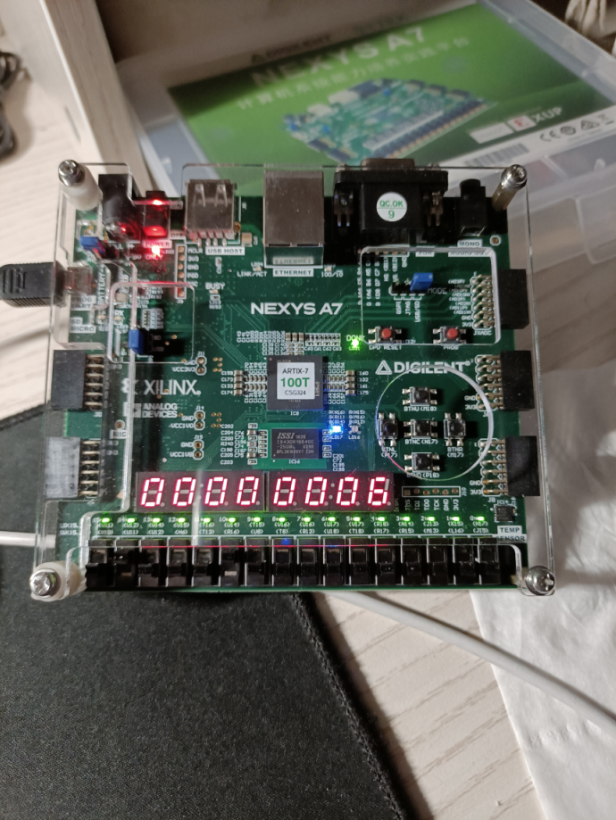

<!--
 * @Author: MomoTori
 * @Date: 2022-03-27 01:02:45
 * @LastEditors: MomoTori
 * @LastEditTime: 2022-05-08 11:03:18
 * @FilePath: \CODExperiment\report\Lab5\report.md
 * @Description: 
 * Copyright (c) 2022 by MomoTori, All Rights Reserved. 
-->

## 目录

<!-- @import "[TOC]" {cmd="toc" depthFrom=1 depthTo=6 orderedList=false} -->

<!-- code_chunk_output -->

- [目录](#目录)
- [流水线cpu设计](#流水线cpu设计)
  - [数据通路](#数据通路)
  - [Forwarding单元](#forwarding单元)
  - [Hazard单元](#hazard单元)
- [流水线CPU测试下载](#流水线cpu测试下载)
- [流水线CPU数组排序下载测试](#流水线cpu数组排序下载测试)
- [实验总结](#实验总结)

<!-- /code_chunk_output -->

## 流水线cpu设计

### 数据通路

数据寄存器的通路如下

```v
//data path of pipeline
always @(posedge clk or negedge rstn) begin
  if(~rstn)
  begin
  PCD_r<=0;
  IR_r<=32'h00000013;//NOP
  PCE_r<=0;
  A_r<=0;
  B_r<=0;
  Imm_r<=0;
  Rd_r<=0;
  Y_r<=0;
  MDW_r<=0;
  RdM_r<=0;
  MDR_r<=0;
  YW_r<=0;
  RdW_r<=0;

  IR_EX_r<=32'h00000013;
  IR_MEM_r<=32'h00000013;
  IR_WB_r<=32'h00000013;
  end
  else begin

  if(B_Hazard)//branch hazard，IR_EX的Instruction清为NOP
      IR_r<=32'h00000013;
  else if(LD_R_Hazard)//Load hazard，stall一个周期
      IR_r<=IR_r;
  else
      IR_r<=Ins;
  
  if(LD_R_Hazard)begin//Load hazard，IR_EX的PC stall一个周期
    PCD_r<=PCD_r;
  end
  else begin
    PCD_r<=pc;
  end
  
  //ID_EX段寄存器
  PCE_r<=PCD_r;
  A_r<=Reg1Data;
  B_r<=Reg2Data;
  Imm_r<=Imm;
  Rd_r<=IR_r[11:7];

  //EX_Mem段寄存器
  Y_r<=ALUResult;
  MDW_r<=B_r_fixed;//B_r_fixed为forwarding之后的B_r
  RdM_r<=Rd_r;

  //Mem_Wb段寄存器
  MDR_r<=ReadData;
  YW_r<=Y_r;
  RdW_r<=RdM_r;

  //特殊地，指令寄存器
  IR_EX_r<=IR_r;
  IR_MEM_r<=IR_EX_r;
  IR_WB_r<=IR_MEM_r;
  end
end
```

流水线的控制信号传递

```v
//control sign of pipeline

//EX段信号
always @(posedge clk or negedge rstn) begin
  if(~rstn)
  begin
  MemtoReg_r_EX<=0;
  MemWrite_r_EX<=0;
  ALUSrc_r_EX<=0;
  RegWrite_r_EX<=0;
  MemRead_r_EX<=0;
  PCChange_r_EX<=0;
  AUIPC_r_EX<=0;
  end
  else begin
  if(LD_R_Hazard|B_Hazard)//发生Hazard，原ID周期的写入全部丢弃
  begin
    MemtoReg_r_EX<=0;
    MemWrite_r_EX<=0;
    RegWrite_r_EX<=0;
    MemRead_r_EX<=0;
    PCChange_r_EX<=0;
  end
  else
  begin
    MemtoReg_r_EX<=MemtoReg;
    MemWrite_r_EX<=MemWrite;
    RegWrite_r_EX<=RegWrite;
    MemRead_r_EX<=MemRead;
    PCChange_r_EX<=PCChange;
  end
  ALUOp_r<=ALUOp;

  ALUSrc_r_EX<=ALUSrc;
  AUIPC_r_EX<=AUIPC;
  end
end
```

```v
//Mem段信号
always @(posedge clk or negedge rstn) begin
  if(~rstn)
  begin
  MemtoReg_r_MEM<=0;
  MemWrite_r_MEM<=0;
  RegWrite_r_MEM<=0;
  MemRead_r_MEM<=0;
  end
  else begin
  MemtoReg_r_MEM<=MemtoReg_r_EX;
  MemWrite_r_MEM<=MemWrite_r_EX;
  RegWrite_r_MEM<=RegWrite_r_EX;
  MemRead_r_MEM<=MemRead_r_EX;
  end
end
```

```v
//Wb段信号
always @(posedge clk or negedge rstn) begin
  if(~rstn)
  begin
  MemtoReg_r_WB<=0;
  RegWrite_r_WB<=0;
  end
  else begin
  MemtoReg_r_WB<=MemtoReg_r_MEM;
  RegWrite_r_WB<=RegWrite_r_MEM;
  end
end
```

### Forwarding单元

对写入的数据提前返回需要的EX段

```v
//forwarding unit
//EX进行的指令是否有SR1或SR2源寄存器
wire SR1,SR2;
assign SR1=~((IR_EX_r[6:2]==5'b11011)|AUIPC_r_EX);
assign SR2=(IR_EX_r[3:2]==2'b00&IR_EX_r[5]);
//是否需要Wb to Ex或Mem to Ex
wire Wb2Ex_sr1,Wb2Ex_sr2,Mem2Ex_sr1,Mem2Ex_sr2;
assign Wb2Ex_sr1=(RdW_r==IR_EX_r[19:15]) & SR1 & RegWrite_r_WB;
assign Wb2Ex_sr2=(RdW_r==IR_EX_r[24:20]) & SR2 & RegWrite_r_WB;
assign Mem2Ex_sr1=(RdM_r==IR_EX_r[19:15]) & SR1 & RegWrite_r_MEM;
assign Mem2Ex_sr2=(RdM_r==IR_EX_r[24:20]) & SR2 & RegWrite_r_MEM;
```

$A$和$B$根据前面的信号，有

```v
reg [31:0] A_r_fixed;//修正后的A
reg [31:0] B_r_fixed;//修正后的B

always @(*) begin
  case({Mem2Ex_sr1,Wb2Ex_sr1})
  2'b00:A_r_fixed=A_r;
  2'b01:A_r_fixed=WriteData;
  2'b10:A_r_fixed=Y_r;
  2'b11:A_r_fixed=Y_r;
  default:A_r_fixed=32'hxxxxxxxx;
  endcase

  case({Mem2Ex_sr2,Wb2Ex_sr2})
  2'b00:B_r_fixed=B_r;
  2'b01:B_r_fixed=WriteData;
  2'b10:B_r_fixed=Y_r;
  2'b11:B_r_fixed=Y_r;
  default:B_r_fixed=32'hxxxxxxxx;
  endcase
end
```

### Hazard单元

有`Load-Use Hazard`和`Branch Hazard`，分别如下

```v
//Load-Use Hazard部分
//对于LD-R类型编排的指令必须有Load-Use Hazard
//若LD_R_Hazard为真则阻塞EX段的输入，反而输入EX为一个NOP

//判断是否有数据冲突
wire SR1_ID,SR2_ID,isLWHazard;
assign SR1_ID=~((IR_r[6:2]==5'b11011)|AUIPC);
assign SR2_ID=(IR_r[3:2]==2'b00&IR_r[5]);
assign isLWHazard=( (Rd_r==IR_r[19:15]) & SR1_ID & (| IR_r[19:15]) ) 
                  | ( Rd_r==IR_r[24:20] & SR2_ID &(|IR_r[24:20]) );

//LD_R_Hazard=EX为LW且ID需要Mem读出的数据
wire LD_R_Hazard;
//其中MemtoReg_r_EX=LW_EX为EX段是否是LW命令
assign LD_R_Hazard=MemtoReg_r_EX&isLWHazard;
```

```v
//Branch Hazard部分
//跳转成功时将已经进入流水线的两个指令清除为NOP
wire B_Hazard;
assign B_Hazard=PCChange_r_EX&(((IR_EX_r[3:2]==2'b00)&zero)|IR_EX_r[2]);
```

## 流水线CPU测试下载

通过测试文件测试均正常运行

## 流水线CPU数组排序下载测试

测试图如下，可以正常输出通过`switch`输入的数组



## 实验总结

通过本实验了解并制作了流水线CPU，学习了从改变方式到发现因其产生的矛盾再到解决矛盾的思路