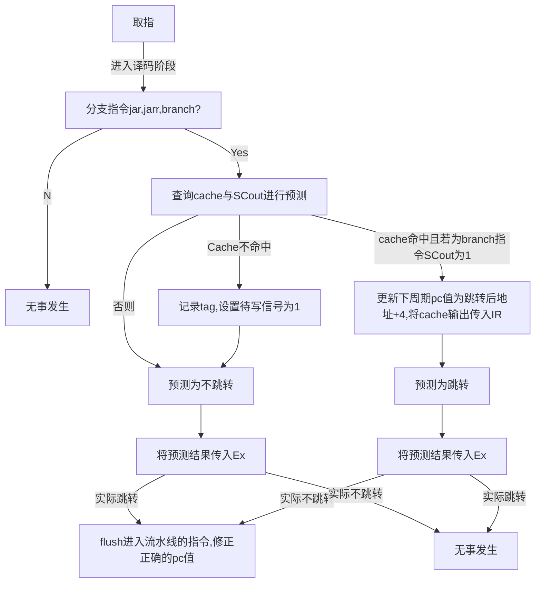

<!--
 * @Author: MomoTori
 * @Date: 2022-05-19 21:53:10
 * @LastEditors: MomoTori
 * @LastEditTime: 2022-05-29 19:06:55
 * @FilePath: \undefinedd:\CodeTry\CODExperiment\report\Lab6\report.md
 * @Description: 
 * Copyright (c) 2022 by MomoTori, All Rights Reserved. 
-->
# 实验六 综合设计

## 目录

<!-- @import "[TOC]" {cmd="toc" depthFrom=1 depthTo=6 orderedList=false} -->

<!-- code_chunk_output -->

- [实验六 综合设计](#实验六-综合设计)
  - [目录](#目录)
  - [补全指令](#补全指令)
  - [动态预测](#动态预测)
    - [饱和计数器](#饱和计数器)
    - [基于全局历史的分支预测](#基于全局历史的分支预测)
    - [跳转指令cache](#跳转指令cache)
  - [内容Cache](#内容cache)

<!-- /code_chunk_output -->

## 补全指令

最后所有指令如图所示

## 动态预测

### 饱和计数器

### 基于全局历史的分支预测

实现了对`branch`的支持

以256个数据排序为例，随机生成多组数据，测试命中率

|预测次数|预测成功次数|命中率|
|-|-|-|
|0x60be|0x52dd|$\frac{21,213}{24,766}=0.8565$|
|0x60be|0x528f|$\frac{21,135}{24,766}=0.8534$|
|0x60be|0x5284|$\frac{21,124}{24,766}=0.8529$|
|0x60be|0x5086|$\frac{20,614}{24,766}=0.8324$|
|0x60be|0x5485|$\frac{21,647}{24,766}=0.8741$|
|>|平均命中率|$0.8543$|

### 跳转指令cache

实现了对`branch`和`jar`的支持，对于`jarr`因为其依赖于寄存器而不好进行处理故不支持

全相连、FIFO

## 内容Cache