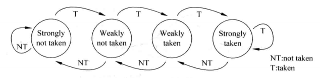

<!--
 * @Author: MomoTori
 * @Date: 2022-05-19 21:53:10
 * @LastEditors: MomoTori
 * @LastEditTime: 2022-05-31 17:41:57
 * @FilePath: \CODExperiment\report\Lab6\report.md
 * @Description: 
 * Copyright (c) 2022 by MomoTori, All Rights Reserved. 
-->
# 实验六 综合设计


## 目录

<!-- @import "[TOC]" {cmd="toc" depthFrom=1 depthTo=6 orderedList=false} -->

<!-- code_chunk_output -->

- [实验六 综合设计](#实验六-综合设计)
  - [目录](#目录)
  - [补全指令](#补全指令)
  - [动态预测](#动态预测)
    - [饱和计数器](#饱和计数器)
    - [基于全局历史的分支预测](#基于全局历史的分支预测)
    - [跳转指令cache](#跳转指令cache)
  - [数据Cache](#数据cache)
    - [模块接口](#模块接口)
    - [变量的声明](#变量的声明)
    - [hit 与 寻道](#hit-与-寻道)
      - [hit](#hit)
      - [寻道](#寻道)
    - [FIFO](#fifo)
    - [读取](#读取)
    - [cache操作](#cache操作)
    - [主存](#主存)

<!-- /code_chunk_output -->

## 补全指令

最后实现的所有可执行指令如图所示

实现均由原本的实现稍作修改得到，比如`lui`由`auipc`得到，将`auipc`中的[+PC]部分改为[+0]即得

其他指令扩展相同不表


## 动态预测

### 饱和计数器



### 基于全局历史的分支预测

实现了对`branch`的支持


以256个数据排序为例，随机生成多组数据，测试命中率

|预测次数|预测成功次数|命中率|
|-|-|-|
|0x60be|0x52dd|$\frac{21,213}{24,766}=0.8565$|
|0x60be|0x528f|$\frac{21,135}{24,766}=0.8534$|
|0x60be|0x5284|$\frac{21,124}{24,766}=0.8529$|
|0x60be|0x5086|$\frac{20,614}{24,766}=0.8324$|
|0x60be|0x5485|$\frac{21,647}{24,766}=0.8741$|
|>|平均命中率|$0.8543$|


### 跳转指令cache

实现了对`branch`和`jar`的支持，对于`jarr`因为其依赖于寄存器而不好进行处理故不支持

全相连、FIFO


## 数据Cache

cache类型：基于全写法和不按写分配法以及FIFO换出策略的组相联cache


### 模块接口

将ip核例化得到的主存与cache一起封装成一个模块

在ip核端口基础上加入写请求 读请求 复位信号

```v
module MEM_CACHE (
  input [7:0] Address,    //cpu给的地址
  input [31:0] WriteData,       //写的数据
  input [7:0] DebugAddr,     //chk用 仅可读
  input clk,
  input wr_req,//写请求信号
  input rd_req,
  input rstn,
  output wire [31:0] ReadData,      //从cache中取出的数据
  output wire [31:0] DebugData,
  //debug
  output wire hit_m
);
```

### 变量的声明

```v
localparam way_cnt = 2;//组相连度
//cache与主存之间使用全写法和不按写分配法
//使用块大小为一字（一字四字节）两组 共计8块的直接映射cache  总容量8*2*1=16字
//FIFO策略
//ADDR: 2:0为index 7:3为tag 

reg [31:0] cache[7:0][way_cnt - 1:0];
reg valid[7:0][way_cnt - 1:0];//标记有效位
reg [4:0] tag[7:0][way_cnt - 1:0];//标签位


reg FIFO[7:0][way_cnt:0];// 实际上就是一个计数器 升满了表示要润了
reg [way_cnt-1:0] outway;//记录哪个通道的数据要被换出 似乎用不到这么多位宽233

wire [31:0] ip_readdata;
wire [2:0] index;
wire [4:0] tag_in;
// reg [way_cnt-1 : 0] way_addr;//记录数据来自哪个通道
wire [way_cnt-1 : 0] way_addr;//记录数据来自哪个通道
assign index = Address[2:0];
assign tag_in = Address[7:3];
```

### hit 与 寻道

#### hit

```v
wire hit;
assign hit = (valid[index][0] && tag[index][0] == tag_in) | (valid[index][1] && tag[index][1] == tag_in);
```

由于cpu需要在上升沿到来之前就准备好从主存中读取的数据，也就是说读取必须在上升沿之前完成

由于always@*出现的时序问题 hit使用wire类型 使用assign赋值 这样可以保证hit永远是最新的值

拓展时只需要复制多几次即可

#### 寻道

由于采用组相联 数据在一个index内是任意存储的 所以读取前需要确定数据在哪个通道

```v
assign way_addr = (valid[index][0] && tag[index][0] == tag_in) ? 0 : 1;
```

拓展时同理 多复制几次即可

### FIFO

思路如下：
1. 首先查找有无未使用的块 若有 跳转3 否则跳转2
2. FIFO使用数值来标记进入顺序 从小到大以此为新进入和旧进入 查找FIFO=way_cnt 即可找到队列头需换出的元素
3. 初始化该位置FIFO 修改其他元素FIFO的值
   

```v
integer i,j;

integer free = 0;//标识是否还有空闲块
always @(posedge clk or negedge rstn)begin
  if(~rstn)begin
    for(i = 0;i < 8;i = i + 1)begin
      for(j = 0;j < way_cnt; j = j + 1)begin
        FIFO[i][j] = 0;
      end
    end
  end
  else begin
    if(~hit && (wr_req | rd_req))begin
      //选出冲突时换出的块
      for(i = 0;i < way_cnt;i = i + 1)begin
        if(FIFO[index][i] == 0)begin//FIFO从1开始升序到way_cnt也就是组相联度
        //0表示还没开始 其实相当于valid位
          outway = i;
          free = 1;
        end
      end
      if(free == 0)begin
        for(i = 0;i < way_cnt;i = i +1)begin
          if(FIFO[index][i] == way_cnt)begin//最大值说明是最早进去的
          //最好是能break 但是应该也不会有多个通道都是最大值
            outway = i;
            FIFO[index][i] =0;
          end
        end
      end
      if(FIFO[index][outway] == 0)begin
        for(i = 0;i < way_cnt;i = i + 1)begin
          if(FIFO[index][i]!=0)begin
            FIFO[index][i] = FIFO[index][i] + 1;
          end
        end
      end
      FIFO[index][outway] = 1;//新数据会被换入到这里 所以可以先赋值为1
    end
  end
end
```
### 读取

使用assign读取以达到在上升沿到来之前读取成功的目的

```
assign ReadData = (hit == 1) ? cache[index][way_addr] : ip_readdata;
```

### cache操作

分未hit 非hit 乘 读取 写入四种情况

非hit写入直接写主存IP核 hit读取由上述assign处理 只需要处理另外两种情况

```v
always@(posedge clk or negedge rstn)begin
  if(!rstn)begin
    for(i = 0;i < 8;i = i + 1)begin
      for(j = 0;j < way_cnt; j = j + 1)begin
        valid[i][j] = 1'b0;
        cache[i][j] = 0;
        tag[i][j] = 0;
      end
    end
  end
  else begin
    if(hit)begin
      if(wr_req)begin//写请求
        cache[index][way_addr] <= WriteData;
        //ip核的话直接写就是了 不需要在这里操作
      end
      //读取完全用assign
    end
    else begin
      if(rd_req)begin
        //读信号有效时才换入
        //不是写的话就是默认的读取模式 读的话需要从内存中载入到缓存 当然为了速度 先直接返回内存读的值
        cache[index][outway] <= ip_readdata;
        valid[index][outway] <= 1'b1;
        tag[index][outway] <= tag_in;
      end
      //写不命中直接写主存就是了 似乎不需要处理
    end
  end
end
```
### 主存

直接使用ip核 由于是全写法 debug信号直接访问主存也是最新的值

```v
DataMem DataMem(
  .a(Address),
  .d(WriteData),
  .dpra(DebugAddr),
  .clk(clk),
  .we(wr_req),
  .spo(ip_readdata),
  .dpo(DebugData)//由于使用的全写法和不按写分配法 所以内存中同样也是最新的值 直接读就可以了
);
```
   
